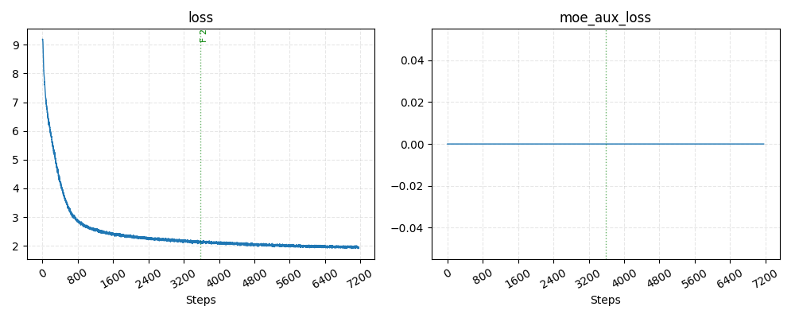
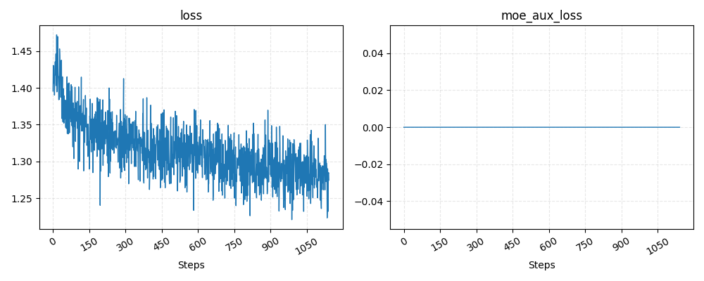
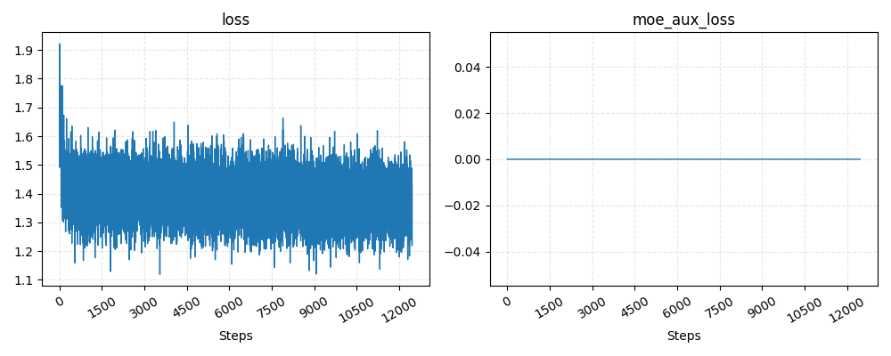
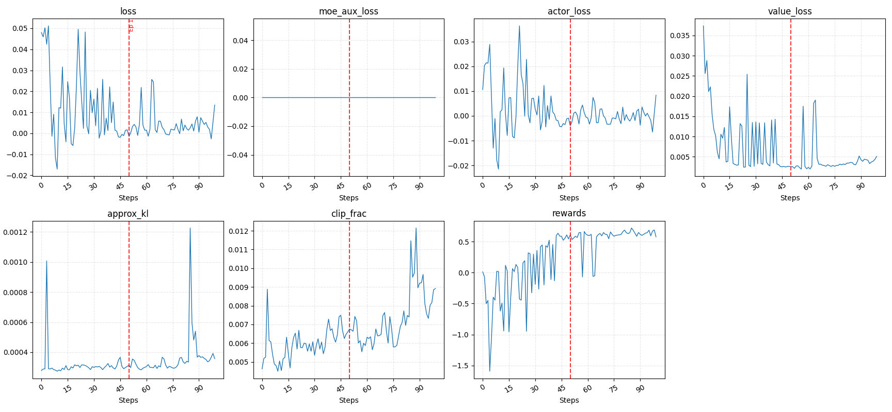

# NanoLM : 微型语言模型全流程训练框架

[](https://www.python.org/)
[](LICENSE)
[](https://github.com/jeurtr/nanolm/actions)
[](https://github.com/jeurtr/nanolm/releases)

**82M 参数。4 张 RTX 4090。7 小时。从零开始的完整 LLM 训练。**

从随机权重到对话助手 —— 一个下午跑完 Pretrain → Midtrain → SFT → PPO 全流程。

## 目录

- [为什么选择 NanoLM？](#为什么选择-nanolm)
- [快速开始](#快速开始)
- [训练流程](#训练流程)
- [对齐方法](#对齐方法)
- [效果速览](#效果速览)
- [模型架构](#模型架构)
- [项目结构](#项目结构)
- [文档](#文档)
- [社区与贡献](#社区与贡献)
- [致谢](#致谢)
- [许可证](#许可证)

## 为什么选择 NanoLM？

大部分 LLM 训练框架面向拥有数百张 GPU 的团队。NanoLM 的目标不同：**让个人开发者在消费级硬件上也能体验从零训练对话模型的完整过程。**

### 与同类项目的对比

| 特性 | NanoLM | NanoGPT | Baby-LLaMA |
|---|:---:|:---:|:---:|
| 完整 RLHF 管线 (PPO/GRPO/DPO) | ✓ | ✗ | ✗ |
| 自训练中文 Tokenizer | ✓ | ✗ | ✗ |
| Web 推理服务 (SSE 流式) | ✓ | ✗ | ✗ |
| 架构选择 (Dense / MoE / VLM) | ✓ | ✗ | ✗ |
| 全流程训练时间 | ~7 h | ~4 h* | ~8 h** |

> \* 仅 Pretrain &nbsp;|&nbsp; \*\* Pretrain + SFT，不含 RL 对齐

### 核心优势

- **极低门槛** — 4 张消费级 GPU（RTX 4090），7 小时内完成从随机权重到对话助手的全流程训练。
- **完整训练链路** — 覆盖 Pretrain → Midtrain → SFT → PPO 四阶段，从随机权重到对齐人类偏好。
- **三种对齐方法** — 同时支持 PPO、GRPO、DPO 三种人类偏好对齐策略，在配置文件里一行切换。
- **架构灵活** — 同一套训练框架支持 Dense / Mixture-of-Experts / Vision-Language Model 三种架构，以及三种 RoPE 模式（default / dynamic / YaRN）。
- **中文优先** — 自训练 8192 词表 SentencePiece Tokenizer，中文编码效率远超通用 Tokenizer。
- **跨平台推理** — CUDA / Apple MPS / CPU 均可推理，无需额外适配。
- **生产可部署** — 内置 Web 对话界面（SSE 流式输出），`USE_WAITRESS=1` 即可生产就绪。
- **自我认知注入** — 训练中过采样身份对话数据，模型能回答"你是谁"。

## 快速开始

### 环境要求

- Python 3.10 或更高版本
- 推荐 NVIDIA GPU（至少 8GB 显存），也支持 Apple Silicon MPS 和纯 CPU 推理

### 一键安装运行

```bash
git clone https://github.com/jeurtr/nanolm.git
cd NanoLM
pip install -r requirements.txt
python -m toolkit web
```

首次运行会自动下载模型权重。启动后在浏览器打开 `http://localhost:8080` 即可对话。

> 生产环境部署：`USE_WAITRESS=1 python -m toolkit web`

<!-- TODO: 添加 Web 对话界面截图 -->

## 训练流程

### 数据预处理

从 ModelScope 下载 [Minimind Dataset](https://www.modelscope.cn/datasets/gongjy/minimind_dataset)，自动完成清洗、分桶和序列化。

```bash
python -m toolkit full      # 一键执行完整预处理管线
python -m toolkit list      # 查看所有可用的数据处理子步骤
```

### 四阶段训练

| 阶段       | 上下文长度 | 目标                   | 耗时 (4×4090) |
| -------- | ----- | -------------------- | ---------- |
| Pretrain | 512   | 在海量文本上学习语言的基础知识      | ~3 h       |
| Midtrain | 2048  | 将上下文窗口从 512 扩展到 2048 | ~1 h       |
| SFT      | 2048  | 用对话数据教模型进行多轮交互       | ~1.5 h     |
| PPO      | 2048  | 通过奖励模型让输出更符合人类偏好     | ~1.5 h     |

#### Pretrain — 预训练

```bash
python -m toolkit train pretrain
cd ckpt_dir && python zero_to_fp32.py . ../ && cd ..
mv pytorch_model.bin last_checkpoint.bin
```

#### Midtrain — 长上下文适应

```bash
python -m toolkit train midtrain
cd ckpt_dir && python zero_to_fp32.py . ../ && cd ..
mv pytorch_model.bin last_checkpoint.bin
```

#### SFT — 监督微调

```bash
python -m toolkit train sft
cd ckpt_dir && python zero_to_fp32.py . ../ && cd ..
mv pytorch_model.bin last_checkpoint.bin
cp last_checkpoint.bin sft.bin
```

#### PPO — 强化学习对齐

此阶段同时维护 Policy 网络和 Value 网络，使用 InternLM2-1.8B 作为奖励模型。

```bash
python -m toolkit train ppo
cd ckpt_dir && python zero_to_fp32.py . ../ && cd ..
mv pytorch_model.bin ppo.bin
python -m toolkit eval extract   # 从联合权重中提取纯 Policy 部分
```

> 详细训练参数和配置说明见 [docs/TRAINING_PIPELINE.md](docs/TRAINING_PIPELINE.md)

### 训练监控

训练日志输出到 `./log/` 目录，可以通过 CLI 查看可视化曲线：

```bash
python -m toolkit analyze loss      # loss 下降曲线
python -m toolkit analyze lr        # 学习率变化曲线
```

## 对齐方法

NanoLM 支持三种人类偏好对齐策略，在配置文件中一行切换：

| 方法 | 论文 | 适用场景 | 配置 |
| --- | --- | --- | --- |
| **PPO** | Schulman et al. 2017 | 标准 RLHF 流程，需要奖励模型 | `configs/ppo.yaml` |
| **GRPO** | Shao et al. 2024 | 无需额外 Value 网络 | `configs/ppo.yaml` |
| **DPO** | Rafailov et al. 2023 | 无需奖励模型，直接偏好对比 | `configs/ppo.yaml` |

## 效果速览

训练完成后对比 SFT 和 PPO 模型的回复质量：

```bash
python -m toolkit eval compare
```

| 阶段  | 平均奖励分数 | 特点               |
| --- | ------ | ---------------- |
| SFT | -0.73  | 能对话，但质量不稳定       |
| PPO | +0.82  | 经 RL 对齐后回复质量显著提升 |

### 训练曲线

| Pretrain | Midtrain | SFT | PPO |
|:---:|:---:|:---:|:---:|
|  |  |  |  |

## 模型架构

基于 Llama 风格 Decoder-only Transformer，当前版本 0.1.1 为 82M Dense 模型：

| 组件 | 配置 |
| --- | --- |
| 参数量 | 82M (hidden_size=768, layers=12, heads=12) |
| 注意力 | GQA (4 KV heads) + QK Norm + RoPE |
| FFN | SwiGLU (intermediate_size=2048) |
| 归一化 | RMSNorm pre-norm |
| Tokenizer | 自训练 8192 词表 SentencePiece |
| 权重绑定 | Embedding 与 LM Head 共享 |

RoPE 支持三种模式：`default`（标准）、`dynamic`（NTK 外推）、`yarn`（YaRN 长上下文）。模型定义同时提供 MoE 和 VLM 扩展，可在配置中启用。

> 完整架构说明见 [docs/MODEL_ARCHITECTURE.md](docs/MODEL_ARCHITECTURE.md)

## 项目结构

每个模块独立运作，按需取用。

```
NanoLM/
├── nanolm/          # 核心包 (API、推理服务、设备检测、配置工具)
├── model/           # 模型定义 (Llama / MoE / VLM)
├── train/           # 训练框架 (Trainer、Loss、Parallel、Checkpoint)
├── toolkit/         # 数据管线与 CLI 入口
├── eval/            # 模型评估与权重后处理
├── configs/         # YAML 训练配置 (支持 extends 继承)
├── docs/            # 详细文档
├── static/          # Web 对话前端
├── tokens/          # Tokenizer 模型文件
└── tests/           # 单元测试
```

## 文档

| 文档 | 内容 |
| --- | --- |
| [项目总览](docs/PROJECT_OVERVIEW.md) | 项目定位、设计理念、目录结构 |
| [模型架构](docs/MODEL_ARCHITECTURE.md) | 参数配置、注意力机制、RoPE、MoE、VLM |
| [训练管线](docs/TRAINING_PIPELINE.md) | 四阶段超参数、损失函数、checkpoint 管理 |
| [数据预处理](docs/DATA_PREPROCESSING.md) | 数据下载、清洗、分桶、Tokenize 全流程 |
| [推理服务](docs/INFERENCE.md) | Web 服务部署、SSE 流式、API 用法 |

## 社区与贡献

我们欢迎所有形式的贡献：Bug 报告、功能建议、文档改进、代码 PR。

- [贡献指南 (CONTRIBUTING.md)](CONTRIBUTING.md)
- [行为准则 (CODE_OF_CONDUCT.md)](CODE_OF_CONDUCT.md)
- [引用本项目 (CITATION.cff)](CITATION.cff)

### 路线图

- [x] 82M Dense 模型 + PPO 对齐
- [x] GRPO 和 DPO 训练支持
- [x] CLI 统一入口
- [ ] MoE 架构训练验证
- [ ] VLM 多模态训练管线
- [ ] PyPI 包发布 (`pip install nanolm`)
- [ ] 模型权重托管 (HuggingFace / ModelScope)

## 致谢

本项目在开发和训练过程中参考了以下开源成果，谨此致谢。

### 训练数据

| 数据集 | 来源 | 用途 |
| --- | --- | --- |
| [Minimind Dataset](https://www.modelscope.cn/datasets/gongjy/minimind_dataset) | ModelScope | 预训练、SFT、RL 全阶段数据 |
| [Cortex-3.0-data](https://www.modelscope.cn/datasets/qibin0506/Cortex-3.0-data) | ModelScope | 预处理结果归档与分发 |

### 模型与架构

| 模型 | 来源 | 用途 |
| --- | --- | --- |
| [InternLM2-1.8B Reward Model](https://github.com/InternLM/InternLM) | 上海人工智能实验室 | PPO 训练中的奖励信号 |
| Llama 架构 | Meta | GQA、SwiGLU、RMSNorm、RoPE 参考 |

### 论文与技术参考

| 技术 | 出处 | 用途 |
| --- | --- | --- |
| RoPE | [Su et al., 2021](https://arxiv.org/abs/2104.09864) | 旋转位置编码 |
| YaRN | [arXiv:2309.00071](https://arxiv.org/abs/2309.00071) | 长上下文位置编码外推 |
| DPO | [arXiv:2305.18290](https://arxiv.org/abs/2305.18290) | 直接偏好优化 |
| CPO | [arXiv:2310.12036](https://arxiv.org/abs/2310.12036) | 对比偏好优化 |
| CDPO | [ericmitchell.ai/cdpo.pdf](https://ericmitchell.ai/cdpo.pdf) | DPO 校准策略 |
| [OpenRLHF](https://github.com/OpenRLHF/OpenRLHF) | — | PPO/GRPO 损失函数参考 |
| [HuggingFace TRL](https://github.com/huggingface/trl) | — | DeepSpeed 模型准备逻辑 |
| DeepSpeed ZeRO | Microsoft | 分布式训练显存优化 |

## 许可证

[Apache 2.0](LICENSE)
